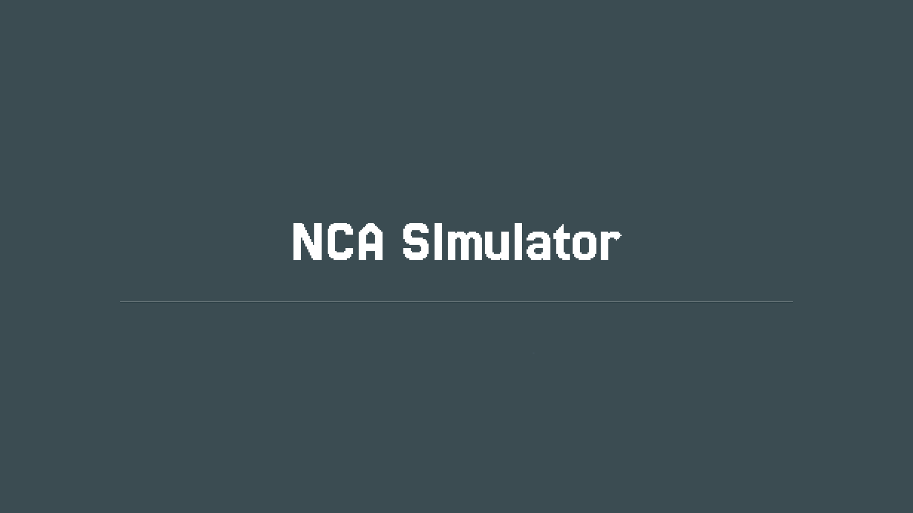

<p align="center">
  
</p>

# Neural Cellular Automata (NCA) Visualizer & Inspector

A web-based interactive visualizer and step-by-step mathematical inspector for **Neural Cellular Automata (NCA)**. This project demonstrates self-organizing systems (e.g., image regeneration and cell growth) using localized rules and neural network computations applied across a grid of cells.

---

## Mathematical Formulation

The NCA state transitions are calculated on a grid of cells. Each cell contains a 16-dimensional state vector $S_t \in \mathbb{R}^{16}$ consisting of:
- **RGBA channels (4)**: RGB color channels (pre-multiplied by alpha) and the Alpha ($\alpha$) channel.
- **Hidden channels (12)**: Hidden state variables used by the cells to communicate and self-organize.

For every step $t \to t+1$, the cellular state updates according to the following mathematical pipeline:

```latex
1. Perception (Sobel Gradients & Identity):
   P = [S_t, S_t * K_x, S_t * K_y] ∈ ℝ^48

2. Neural Network Update (1x1 MLP Convolution):
   ΔS = Dense_2( ReLU( Dense_1(P) ) )

3. Stochastic Update Mask:
   M ~ Bernoulli(0.5)

4. Alive Masking & Next State:
   S_(t+1) = (S_t + M ⊙ ΔS) ⊙ AliveMask
```

### Pipeline Details

#### 1. Perception
Each cell inspects its 3x3 neighborhood using three predefined filters:
- **Identity Filter ($I$)**: Captures the current cell's state.
- **Sobel X ($K_x$) / Sobel Y ($K_y$)**: Calculates horizontal and vertical spatial gradients. Filters are normalized by $1/8$ to maintain gradient magnitude stability:
  $$K_x = \frac{1}{8} \begin{bmatrix} -1 & 0 & 1 \\ -2 & 0 & 2 \\ -1 & 0 & 1 \end{bmatrix}, \quad K_y = \frac{1}{8} \begin{bmatrix} -1 & -2 & -1 \\ 0 & 0 & 0 \\ 1 & 2 & 1 \end{bmatrix}$$
The resulting 48-dimensional perception vector $P$ is constructed by concatenating the filter outputs:
$$P = [S_t * I, \; S_t * K_x, \; S_t * K_y] \in \mathbb{R}^{48}$$

#### 2. Neural Network Update (1x1 Convolution)
The perception vector $P$ is passed through a 2-layer Feed-Forward Neural Network (MLP) mapping 48 channels to 16 output channels:
$$\Delta S = \text{Dense}_2(\text{ReLU}(\text{Dense}_1(P)))$$
- **$\text{Dense}_1$**: Shape $48 \times 128$ (Input $\to$ Hidden)
- **$\text{ReLU}$**: Activation function applied element-wise on the 128 hidden activations.
- **$\text{Dense}_2$**: Shape $128 \times 16$ (Hidden $\to$ Output Delta $\Delta S$)

#### 3. Stochastic Update Mask
To simulate asynchronous updates, cells update stochastically. A Bernoulli mask $M \sim \text{Bernoulli}(0.5)$ determines whether a cell updates its state or retains the previous state.

#### 4. Alive Masking
A cell is considered "alive" if the maximum alpha channel ($\alpha$) in its 3x3 neighborhood is greater than $0.1$. For a cell state update to persist, the cell must be alive both **before** (Pre-Alive) and **after** (Post-Alive) the candidate update:
$$\text{AliveMask} = \text{PreAlive} \wedge \text{PostAlive}$$
$$S_{t+1} = (S_t + M \odot \Delta S) \odot \text{AliveMask}$$

---

## Core Features & Models

- **Pure JavaScript Engine**: Zero external dependencies for the mathematical execution core, utilizing optimized flat `Float32Array` buffers.
- **Pre-trained Target Shapes**: Decodes and runs 10 pre-trained shapes:
  - `lizard` (default), `tree`, `ladybug`, `fish`, `eye`, `explosion`, `spiderweb`, `smiley`, `pretzel`, `butterfly`.
  - When simulation is played or stepped for the first time after a reset, a target model is chosen and loaded at random.

---

## Interactive Controls & Grid Selection

- **Interactive Cell Selection**: Click on any cell in the 32x32 grid to inspect its step-by-step mathematical logic in real-time. The selected cell is highlighted in **red** and its 3x3 neighborhood is highlighted in **blue**.
- **Play / Pause**: Toggle the real-time simulation loop.
- **Step**: Advance the simulation by exactly one step.
- **Reset**: Clear the grid state to zero, reset the step counter, and clear the active model selection.
- **Seed**: Manually plant a seed cell in the center of the grid (sets RGBA to $[0,0,0,1]$ and all hidden channels to $1.0$).
- **Speed Slider**: Control the simulation speed (from 1 to 20 steps per animation frame).
- **Channel Select Menu**: Toggle the grid's visual rendering between standard pre-multiplied RGB mode and any of the 16 individual channels (RGBA + 12 hidden channels) rendered as grayscale intensities.

---

## Inspector UI Metrics

The Inspector panel displays the mathematical logic for a selected cell.

| Section | Description | Key Metrics Displayed |
| :--- | :--- | :--- |
| **Cell Info** | Basic coordinates and cell status. | • Coordinates (X, Y)<br>• Alive Status: Pre-Alive and Post-Alive status.<br>• Update Status: Updated or Skipped (Bernoulli mask). |
| **Current State** | The 16-dimensional state vector ($S_t$). | • 3x3 Alpha Matrix: Neighborhood alpha values.<br>• 16-Channel Bars: RGBA (4) and hidden channels (12). |
| **Perception** | The 48-dimensional perception vector ($P$). | • Filter matrices (Identity, Sobel X, Sobel Y).<br>• Split vectors: Self (16), Horizontal (16), and Vertical (16) gradients. |
| **Neural Network** | The 1x1 MLP Conv layers and activations. | • Network Flow: Input (48) $\to$ Hidden (128) $\to$ ReLU $\to$ Output (16).<br>• Active Neurons counter.<br>• Output Delta ($\Delta S$) channel values. |
| **State Update** | The final calculated next state ($S_{t+1}$). | • Next State Vector: Highlighted state change comparison.<br>• Applied Masking rules. |

---

## Project Structure

```text
NCA/
├── index.html         # Main entry point and UI layout
├── server.sh          # Local development server script
├── models/            # Pre-trained model assets (.json)
└── src/
    ├── app.js         # Application entry point and controller
    ├── index.css      # UI stylesheet
    ├── core/          # Core mathematical and logical engine
    │   ├── nca.js     # Main cellular automata execution pipeline
    │   ├── math.js    # Matrix operations, Sobel filters, and activation functions
    │   ├── config.js  # Constant configurations and thresholds
    │   └── modelWeights.js # Pre-trained model loader and decoder
    └── ui/            # UI renderer modules
        ├── grid.js    # Canvas grid rendering
        └── inspector.js # Interactive step-by-step inspector panel
```

---

## Running Locally

Execute the provided shell script to start the local development server:

```bash
# Start the server (port 8000)
./server.sh start

# Check server status
./server.sh status

# Stop the server
./server.sh stop

# Clear the server log file (server.log)
./server.sh clear-log
```

Alternatively, run a Python HTTP server manually:

```bash
python3 -m http.server 8000
```

Navigate to `http://localhost:8000` in a web browser.
